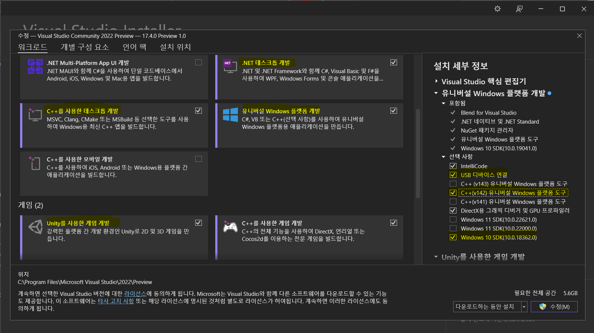

# Unity development for HoloLens


### Reference Link

[HoloLens 2 tutorials](https://learn.microsoft.com/en-us/training/paths/beginner-hololens-2-tutorials "HoloLens 2 tutorials")

[MRTK3 Tutorial: "Zappy's Playground"](https://github.com/microsoft/ZappysPlayground "Zappy's Playground")

[OpenXR-Unity-MixedReality-Samples](https://github.com/microsoft/OpenXR-Unity-MixedReality-Samples "OpenXR-Unity-MixedReality-Samples")

[Vuforia HoloLens Sample](https://library.vuforia.com/platform-support/working-hololens-sample-unity "Vuforia HoloLens Sample")

[HoloLens 2 자습서](https://learn.microsoft.com/en-us/training/paths/beginner-hololens-2-tutorials/ "HoloLens 2 자습서")

----

### Requirement Link

[Mixed Reality Feature Tool](https://www.microsoft.com/en-us/download/details.aspx?id=102778 "Mixed Reality Feature Tool")

[.NET 5.0](https://dotnet.microsoft.com/en-us/download/dotnet/5.0 ".NET 5.0")

### [ Set Up Project ] 

#### - Installing Visual Studio 2022
Be sure you install the following workloads:

</img>
```
● .NET desktop development
● Desktop development with C++
● Universal Windows Platform (UWP) development
● Game development with Unity (if planning to use Unity)
```

Note: Some of these workloads may be pre-installed if you've installed Unity first. Make sure you have all of these workloads for a successful deployment. 

Within the UWP workload, make sure the following components are included for installation:
```
● Windows 10 SDK version 10.0.19041.0 or 10.0.18362.0, or Windows 11 SDK
● USB Device Connectivity (required to deploy/debug to HoloLens over USB)
● C++ (v142) Universal Windows Platform tools (required when using Unity)
```


#### - We recommend using latest Unity 2020.3.35f1 or later LTS

- Universal Windows Platform Build Support
- Windows Build Support (IL2CPP)

While we currently recommend installing Unity 2020.3 LTS with the Mixed Reality OpenXR plugin for Mixed Reality development, you can build apps with other Unity configurations as well.

To build an app for Windows Mixed Reality, you must choose a build target. The build settings for ***Universal Windows Platform (UWP)** target any device, including immersive headsets like the HP Reverb G2. This is the best choice if you're building for ***the HoloLens 2***; however, if you're targeting desktop VR, we recommend that you use the PC, Mac & Linux Standalone platform

</img>

```
Target Device : HoloLens
Build Type: D3D Project
Target SDK Version: Latest Installed
Minimum Platform Version: 10.0.10240.0
Visual Studio Version: Latest installed
```


#### - Set up a new OpenXR project with MRTK

[Mixed Reality Feature Tool](https://www.microsoft.com/en-us/download/details.aspx?id=102778 "Mixed Reality Feature Tool")
[.NET 5.0](https://dotnet.microsoft.com/en-us/download/dotnet/5.0 ".NET 5.0")

The best way to discover, update, and import feature packages is with the Mixed Reality Feature Tool. You can search packages by name or category, see their dependencies, and view proposed changes to your project's manifest file before importing.

[Step by step Tutorial](https://learn.microsoft.com/en-us/windows/mixed-reality/develop/unity/new-openxr-project-with-mrtk "Import the Mixed Reality Toolkit and OpenXR packages")


##### ***Caution***

When working on Windows, there is a MAX_PATH limit of 255 characters. Unity is affected by these limits and may fail to compile if any file path is longer than 255 characters. Therefore, we recommend that you store your Unity project as close to the root of the drive as possible.

[Known issues in Unity versions and packages](https://learn.microsoft.com/en-us/windows/mixed-reality/develop/unity/known-issues "Known issues ")
